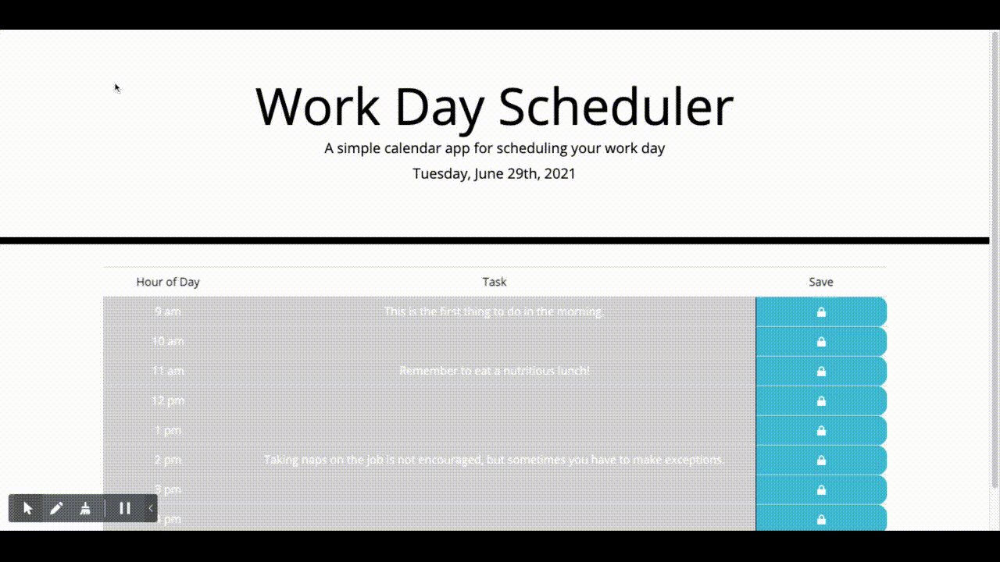

# Work Day Scheduler
A single-day calendar display for tracking tasks during work hours.

## Description
This single-day calendar helps users keep track of their schedule by permitting them to add, edit, and remove tasks from their list of to-dos. It is color-coded to help users better see which tasks are in the past, present, and future. 

## Languages, Frameworks, and Libraries Used
- HTML
- CSS
- JavaScript
- jQuery
- Moment.js
- Bootstrap

## Deployed Application
[You can find the deployed application at this address.](https://rrcampbell-exe.github.io/calendar-app/)

## Screenshot

